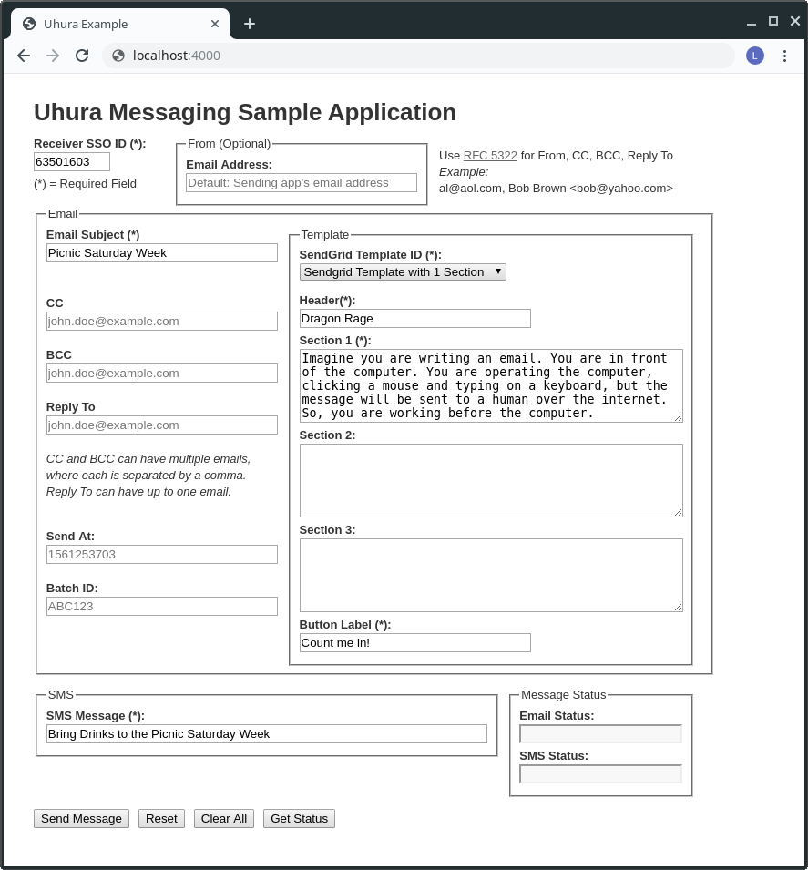

# Uhura Example App

The Uhura Example App allows you to test the [Uhura Client](https://github.com/dailydrip/uhura-client) Ruby gem using a Rails web app, i.e., this example application.


## Getting Started

These instructions will get you up and running with Uhura on your local machine for development and testing purposes. 

## Prerequisites

- Git
- Ruby 2.6.3
- bundler 2.0.2
- PostgreSQL
- Yarn

### Git

Follow the [Connecting to GitHub with SSH](https://help.github.com/en/articles/connecting-to-github-with-ssh) instructions.

### Ruby 2.6.3

If you might need to install more than one version of Ruby on your server, consider using [rbenv](https://github.com/rbenv/rbenv) or [rvm](https://rvm.io/) to help you manage your Ruby version.

### bundler 2.0.2

Install the bundler gem, s.t., you can later run the `bundle` command and install Uhura's Ruby dependencies:

```bash
gem install bundler:2.0.2
```

### PostgreSQL

If you want to install the [PostgreSQL](https://www.postgresql.org/) database sever locally for development purposes you can follow these steps on Ubuntu. 

NOTE: Replace `lex` with your operating system's username below:

```bash
$ sudo apt update
$ sudo apt install postgresql postgresql-contrib
$ sudo -i -u postgres psql
postgres=# CREATE ROLE lex LOGIN SUPERUSER;
```

Giving your user role the SUPERUSER attribute allows you to run Rails database manipulation commands and migrations, e.g., `bundle exec rake db:create`. The LOGIN attribute is also required.

NOTE: See [Troubleshooting Guide](docs/troubleshooting.md) to see how to install PostgrSQL client library if you chose not to install the PostgreSQL database server in the server instance where you install Uhura.

### Yarn

Install the Yarn package on your workstation.  For an Ubuntu server:

```bash
sudo apt-get update
sudo apt-get upgrade
sudo apt-get dist-upgrade
curl -sS https://dl.yarnpkg.com/debian/pubkey.gpg | sudo apt-key add -
echo "deb https://dl.yarnpkg.com/debian/ stable main" | sudo tee /etc/apt/sources.list.d/yarn.list
sudo apt-get update && sudo apt-get install  yarn
```

#### Install NPM Packages

```
yarn install --check-files
```


## Environment Variables

You must have `ADMIN_NAME` and `ADMIN_PASSWORD` as environment variables to login to this example application.  

### Uhura Client Environment Variables

Change the `UHURA_BASE_API_URL` to the [Uhura Messaging Server](https://github.com/dailydrip/uhura) endpoint and verify that the other UHURA variables are correct:

```bash
export UHURA_BASE_API_URL="http://localhost:3000/api/v1"
export UHURA_API_KEY="deadbeef00deadbeef01"
export UHURA_TEAM_ID="1"
export UHURA_PUBLIC_TOKEN="deadbeef02deadbeef03"
```


### Create Your .env File

See the *Create Your .env File* section below.


## Installation

#### 1. Install Uhura Exmple App 

Let's assume our Uhura project root directory is `~/Projects/uhura-example-app`

```bash
$ mkdir ~/Projects
$ cd ~/Projects
$ git clone https://github.com/dailydrip/uhura-example-app.git
$ cd uhura-example-app
$ bundle
$ bundle exec rails webpacker:install
```

#### 2. Create and Source Your .env File

Run the following command and edit your .env file to match your environment.

```bash
mv sample.env .env
```

You can load those environment variables into your terminal's session by sourcing your project's .env file:

```bash
source .env
```

#### 3. Run Uhura Server

```bash
$ PORT=4000 bundle exec rails server
```

#### 4. Open Uhura Example Application

Go to `http://localhost:4000` and you'll see the application:




### Usage Guide

For more discussion of how to use the Uhura Example Application and how to configure Sendgrid templates, please see the  Uhura Example Application's [Usage Guide](https://github.com/dailydrip/uhura-example-app/blob/master/docs/usage_guide.md).


## Tests

### rspec tests

```sh
$ bundle exec rspec
```


## Staging

The application uses BASIC AUTH when in `staging`. We use the same password and username for the admin.


# License

This project is licensed under the MIT License - see the [LICENSE](LICENSE) file for details
