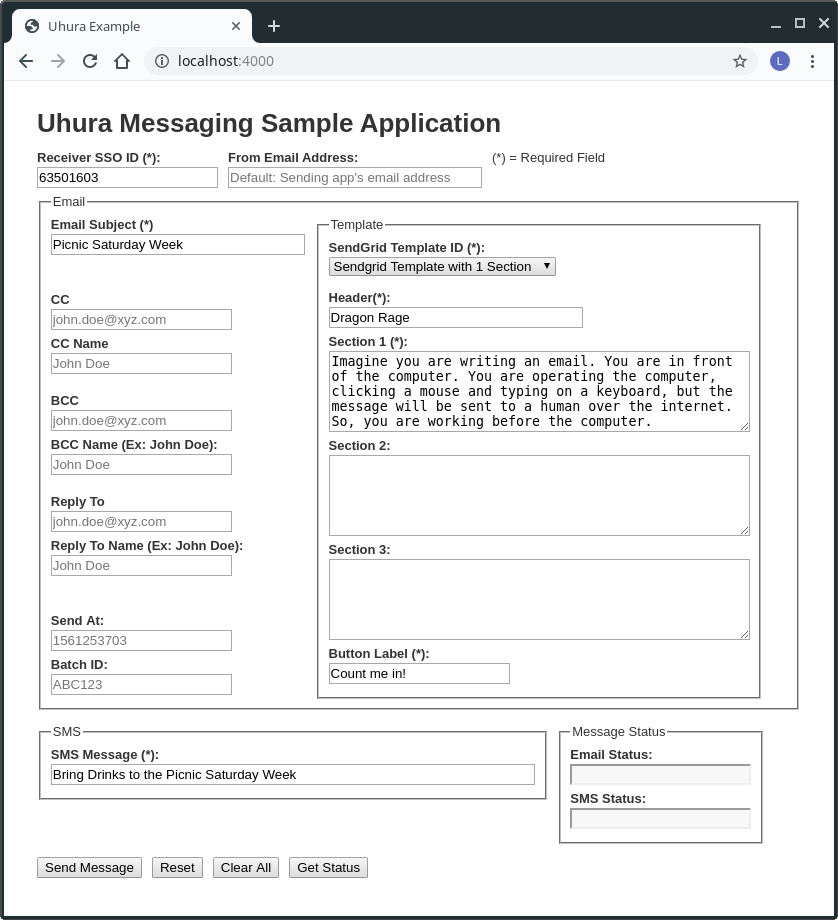
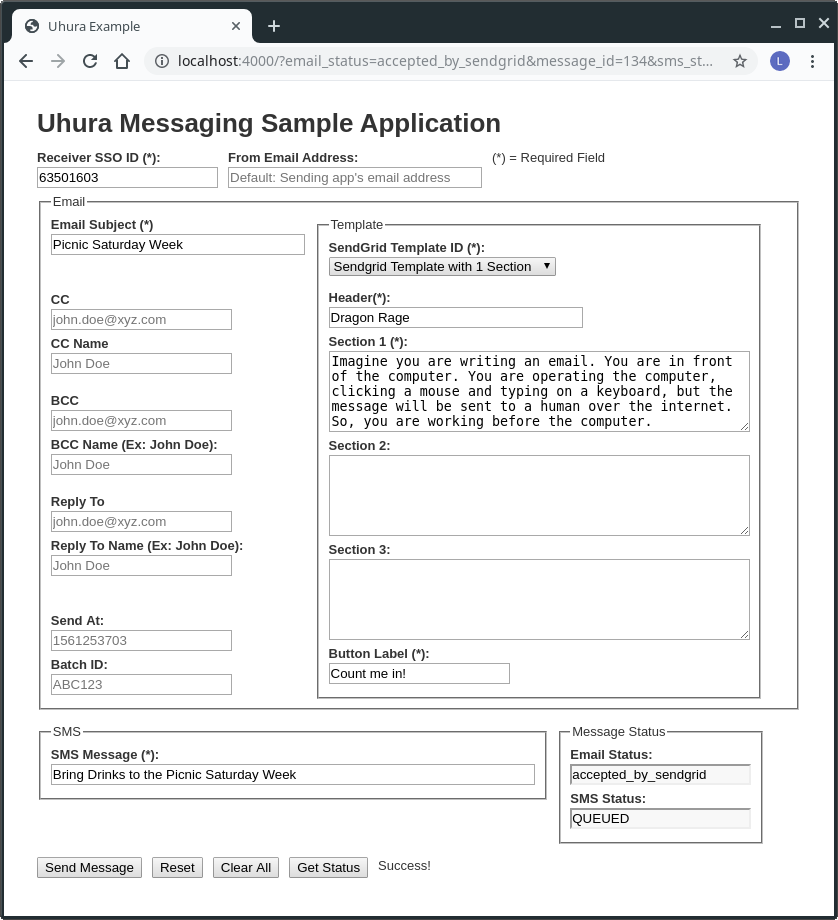
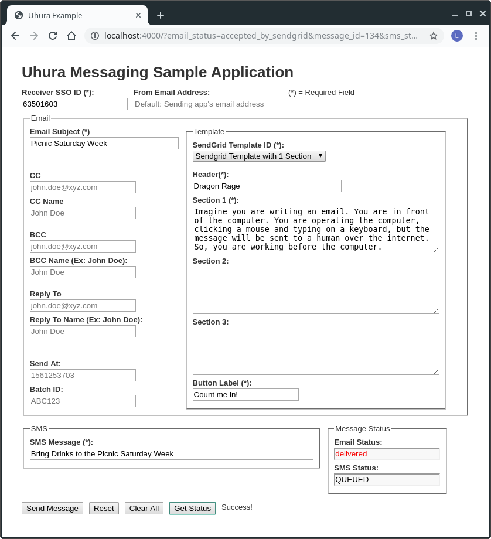
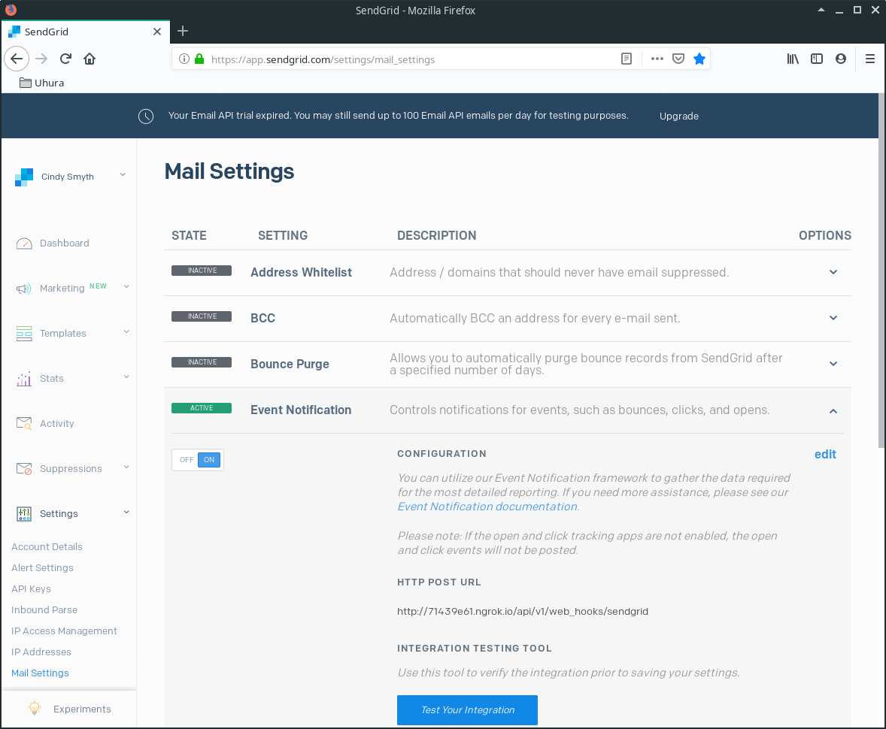
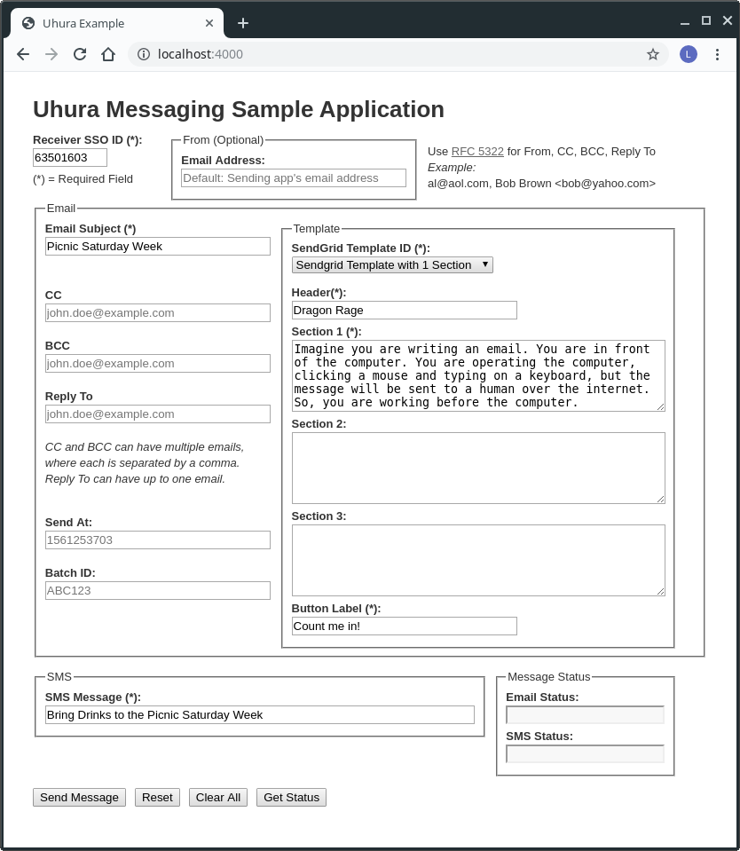

# Uhura Admin Guide

This guide contains screenshots of Uhura's example application.

First, navigate to where you started the Uhura Example App.  

## Screen Shots

In our example, we started the app on port 4000.

Fields are filled with default values.  

For example, the **Email Subject** field: `Picnic Saturday Week`

Fields with filler examples are shown in gray. 

For example, the **CC** field: `john.doe@xyz.com`

### Send Message

After we click the <Send Message>

Initially, **Email Status **will be `accepted` Uhura infers this status when it receives a `202` status code from Sendgrid (which means Sendgrid accepted the message successfully).

#### Get Status

To get the latest updates, click the **\<Get Status>** button.

### Email Status

First, you need to configure Sendgrid to process event notifications

The **Email Status** field will move through the following states:

- accepted
- processed
- delivered
- open

The status will likely move through the first three states quickly, but it won't be until the recipient opens their message will the **Email Status** change to `open`.

### SMS Status

Uhura uses Clearstream to process SMS messages.

Currently, Clearstream takes 30 minutes to send event notifications back to Uhura.

# UPDATE

A From Email Adress has been added to the Uhura Example Application to allow the user to override the default, i.e., the email address associated with the sending application.

Here's what it looks like as of 22 Aug 2019:

### From Email Address

If you don't populate the **From Email Address** field, Uhura will use the sending app's email address from Uhura's **managers** table.

### CC, BCC, Reply To

You can enter multiple email addresses to the CC and BCC fields.

#### Format for Multiple Email Addresses

##### Simple Email Addres

You can simply enter an email address, e.g., `al@aol.com`;

##### Email Address with Name

You can also add a name that is associated with the email address like this:

`Bob Brown <bob@yahoo.com>`

##### Multiple Email Addresses

You can enter multiple email addresses, that you separate with a comma.  They can be in the simple email address format and/or the email address with name format.  Here's an example:

`al@aol.com, Bob Brown <bob@yahoo.com>`

##### Reply To Field

The Reply To field can have zero or one email address of either format.

# License

This project is licensed under the MIT License - See the [LICENSE](LICENSE.txt) file for details.